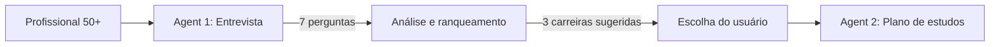
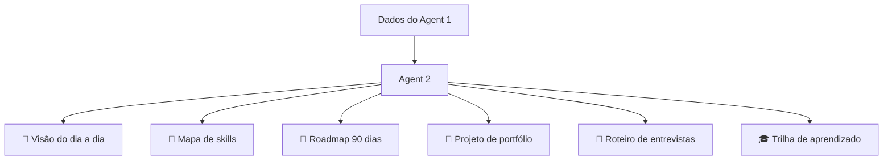
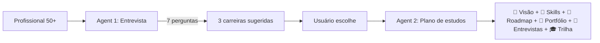

# Mentor de Carreira para Profissionais 50+

Focado em profissionais com experiência em gestão de projetos e/ou análise de negócios que estejam interessado em migrar para IA, Agentes de IA, Engenharia de Prompts e/ou Neo4j.

# 🧭 Agent 1 – Entrevistador de Carreira para Profissionais 50+

> *"Sua experiência não fica para trás. Ela é seu ponto de partida."*

Este agente foi projetado para **profissionais com mais de 50 anos**, que possuem sólida experiência em **gestão de projetos** e **análise de negócios**, e desejam migrar para áreas de ponta como:

- Inteligência Artificial (IA)
- Agentes de IA
- Engenharia de Prompts
- Neo4j (bancos de dados de grafos)

---

## 🎯 Propósito do Agent 1

O Agent 1 atua como um **entrevistador de carreira especializado**. Ele conduz uma conversa estruturada de **7 perguntas** para:

- Mapear interesses, motivações e disponibilidade
- Identificar como suas habilidades de gestão e análise se transferem para a nova área
- Avaliar o melhor caminho com base em **soft skills**, **ramp-up realista** e **demanda de mercado**
- Sugerir **3 carreiras ranqueadas** dentro do nicho de IA

Após a entrevista, o Agent 1 transfere os dados para o **Agent 2**, que cria um plano de estudos personalizado.

---

## ✨ Características do Agent 1

| Característica | Descrição |
|----------------|-------------|
| 🎩 **Tom respeitoso** | Valoriza a trajetória do profissional, sem paternalismo |
| 🧠 **Perguntas estratégicas** | Explora *como* as habilidades de gestão/análise se aplicam à IA |
| 📊 **Matriz de decisão ponderada** | Inclui aproveitamento de soft skills e ramp-up realista para 50+ |
| 🎯 **Carreiras focadas no nicho** | Sugere apenas rotas dentro de IA, Agentes, Prompt e Neo4j |
| 💬 **Linguagem encorajadora** | Evita a síndrome do "começar do zero" – você parte da sua bagagem |

---

## 🧠 Exemplo da Matriz de Decisão (uso interno)

O Agent 1 avalia cada carreira com critérios como:

- Aproveitamento da experiência em gestão/análise (peso maior)
- Afinidade com o tema de interesse declarado
- Demanda de mercado para profissionais 50+
- Ramp-up realista (máximo 9 meses para projetos práticos)
- Disponibilidade de estudo

Com isso, ele ranqueia as 3 melhores opções para o perfil.

---

## 🚀 Por que este prompt é eficaz para o profissional 50+?

1. **Valoriza a experiência anterior** – cada pergunta convida o usuário a *traduzir* sua bagagem, não a abandoná-la.

2. **Realista para 50+** – evita jargões de "junior", fala em ramp-up, vantagens competitivas e ritmo sustentável.

3. **Focado no nicho específico** – IA, Agentes, Prompt e Neo4j. Nada de sugestões genéricas.

4. **Matriz com pesos inteligentes** – prioriza soft skills (gestão, stakeholders, negócio) em vez de apenas código.

5. **Tom respeitoso e encorajador** – elimina a síndrome do "começar do zero". Você chega com vantagens.

---

## 📦 Fluxo de trabalho



---

## 🧪 Exemplo de pergunta do Agent 1

> *"Das suas experiências anteriores – gestão de riscos, levantamento de requisitos, modelagem de processos, liderança de times ou análise de ROI – qual você considera que daria mais vantagem competitiva num time de IA?"*

Perceba como a pergunta **parte da bagagem** e a convida a se tornar vantagem.

---

## 📁 Como usar

1. Conecte este prompt ao seu agente de IA preferido (GPT, Claude, Gemini etc.)
2. O agente fará exatamente 7 perguntas, uma por vez
3. Após as respostas, ele sugerirá 3 carreiras ranqueadas
4. Escolha uma e ele passará para o **Agent 2** (plano de estudos)

> 🔁 Este agente foi projetado para trabalhar **em conjunto com o Agent 2**. Sozinho, ele já orienta – mas o par gera um roadmap completo.

---

## 👤 Público-alvo

- Profissionais com **50 anos ou mais**
- Experiência comprovada em **gestão de projetos** e/ou **análise de negócios**
- Interesse real em migrar para **IA, Agentes de IA, Engenharia de Prompts ou Neo4j**
- Disponibilidade para estudos práticos (mesmo que poucas horas por semana)

---

## 📄 Licença

Uso livre para fins educacionais e de recolocação profissional. Mantenha os créditos ao adaptar.

---

> *"Sua experiência de décadas não é um peso – é o diferencial que faltava nos times de IA."*  
> — Agent 1


---

# 🗺️ Agent 2 – Planejador de Carreira para Profissionais 50+

> *"Você não está começando do zero. Está adicionando uma superferramenta nova a uma carreira já sólida."*

Este agente recebe as informações coletadas pelo **Agent 1** e constrói um **plano de estudos personalizado** para profissionais 50+ com experiência em gestão de projetos e análise de negócios que desejam migrar para:

- Inteligência Artificial (IA)
- Agentes de IA
- Engenharia de Prompts
- Neo4j (bancos de dados de grafos)

---

## 🎯 Propósito do Agent 2

O Agent 2 é um **planejador de carreira especializado**. A partir dos dados enviados pelo Agent 1, ele gera um plano completo que inclui:

- 🧩 **Visão do dia a dia** – atividades que combinam IA com gestão/análise
- 🧠 **Mapa de skills** – o que você já domina e o que vai construir
- 📅 **Roadmap de 90 dias** – respeitando ritmo de 50+, evitando burnout
- 🚀 **Projeto de portfólio** – com propósito real, não "toy project"
- 💬 **Roteiro de entrevistas** – perguntas específicas para quem está migrando
- 🎓 **Trilha de aprendizado** – personalizada para o nicho (com alternativas gratuitas)

---

## ✨ Características do Agent 2

| Característica | Como o Agent 2 atende |
|----------------|------------------------|
| 🎩 **Tom respeitoso** | "Você não está começando do zero" – linguagem de alavancagem, não de compensação |
| 🧩 **Visão do dia a dia** | Cada atividade conecta IA com gestão/análise (ex: traduzir requisitos em prompts) |
| 📅 **Roadmap realista** | Blocos de 45-60 minutos, evita burnout, ajusta prazos para poucas horas |
| 🚀 **Portfólio com propósito** | Projeto resolve um problema real que o profissional já enfrentou |
| 💬 **Entrevistas adaptadas** | Perguntas sobre transição de carreira e etarismo implícito |
| 🎓 **Trilha real** | Não força DIO se não houver – sugere alternativas gratuitas de ponta |

---

## 🧠 O que torna este plano especial para profissionais 50+?

### 1. Valoriza a experiência prévia
Antes de listar o que você precisa aprender, o Agent 2 mostra **o que você já sabe e que é valioso**:

- ✅ Gestão de projetos e entregas
- ✅ Levantamento de requisitos e análise de negócios
- ✅ Comunicação com stakeholders
- ✅ Visão de ROI e métricas de negócio

### 2. Realista sobre ritmo
O roadmap não assume que você tem 30 horas livres por semana. Ele respeita sua energia:

- Blocos de **45-60 minutos**
- **3-4 sessões por semana**
- Prazos estendidos para quem tem menos de 5h/semana

### 3. Portfólio que demonstra liderança de pensamento
O projeto não é um "hello world" genérico. Ele precisa:

- Resolver um problema **que você já enfrentou como gestor/analista**
- Incluir uma seção "Como minha experiência anterior contribuiu"
- Ser explicável em 3 minutos para um stakeholder

### 4. Entrevistas que preparam para o etarismo implícito
O roteiro inclui perguntas difíceis como:

> *"Você não acha que está tarde para aprender IA?"*

E ensina respostas que transformam a idade em vantagem competitiva.

---

## 📦 Estrutura completa do plano gerado



### Exemplo de seção: Roadmap de 90 dias

**MÊS 1 – FUNDAMENTOS**
- Semana 1-2: Conceitos essenciais + primeiros testes práticos
- Semana 3-4: Padrões e boas práticas + caso real baseado na sua experiência

**MÊS 2 – PRÁTICA COM PROPÓSITO**
- Semana 5-6: Primeiro projeto completo documentado
- Semana 7-8: Automação + publicação no LinkedIn/GitHub

**MÊS 3 – PORTFÓLIO E PREPARAÇÃO**
- Semana 9-10: Refinamento com feedback
- Semana 11-12: Pitch de transição + atualização do perfil

---

## 💬 Exemplo de pergunta de entrevista tratada

**Pergunta:** *"Você não acha que está tarde para aprender IA?"*

**Resposta sugerida pelo Agent 2:**
> *"IA de 2025 não exige PhD. Exige pensamento estruturado, capacidade de definir problemas e iterar. Isso eu fiz por {X anos}. A parte técnica aprendi em 90 dias e já tenho um projeto no GitHub resolvendo exatamente o problema {Y}. Minha senioridade em gestão é rara nesse nicho."*

---

## 🎓 Abordagem da trilha de aprendizado

O Agent 2 **não força uma plataforma específica**. Ele sugere o melhor recurso disponível:

| Nicho | Recurso recomendado | Custo |
|-------|---------------------|-------|
| Engenharia de Prompts | DeepLearning.AI (ChatGPT Prompt Engineering) | Grátis |
| Agentes de IA | LangChain Academy + DeepLearning.AI | Grátis |
| Neo4j | GraphAcademy (Cypher Fundamentals) | Grátis com certificado |
| IA geral | Google Cloud Skills Boost (Gen AI) | Grátis |

> Se a DIO tiver uma trilha específica para o nicho, o Agent 2 a recomenda. Caso contrário, indica a **melhor alternativa gratuita disponível**.

---

## 🔄 Fluxo completo com Agent 1 + Agent 2



---

## 📁 Como usar

1. O **Agent 1** conduz a entrevista e coleta os dados
2. O Agent 1 transfere para o Agent 2 com:
   - Carreira escolhida
   - Horas disponíveis por semana
   - Experiência prévia e vantagem competitiva
   - Objetivo e tema de interesse
3. O Agent 2 gera o **plano completo e personalizado**
4. O profissional recebe um roadmap prático para os próximos 90 dias

---

## 👤 Público-alvo

- Profissionais com **50 anos ou mais**
- Experiência em **gestão de projetos** e/ou **análise de negócios**
- Migrando para **IA, Agentes de IA, Engenharia de Prompts ou Neo4j**
- Buscam um plano **realista, respeitoso e aplicável**

---

## 📄 Licença

Uso livre para fins educacionais e de recolocação profissional. Mantenha os créditos ao adaptar.

---

> *"Sua vantagem competitiva não é saber Python aos 20 anos. É saber qual problema resolver – e convencer os stakeholders de que vale a pena."*  
> — Agent 2
```
